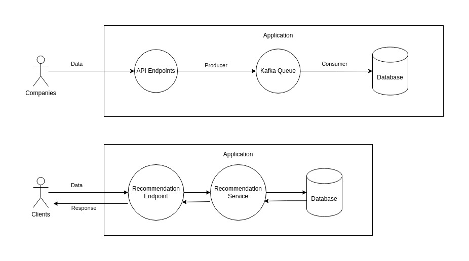

# Systems Programming

## Project Description

A simple recommendation system that provides personalized recommendations.

### Client Data Flow:

- Companies interact with the system via APIs, sending data such as user information, coupons, and events.
- Clients interact with the system via APIs, sending their request and receiving a personalized recommendation.
- API Gateway: Receives client/company requests and forwards them to the appropriate services.
- Kafka Producers: Translate incoming data into messages and publish them to specific topics in Apache Kafka.

### Diagram of the System Architecture:


### Data Processing with Kafka and MySQL:

- **Apache Kafka**: Acts as a distributed messaging queue, handling high-throughput data streams efficiently.
- **Kafka Consumers**: Continuously read messages from relevant topics, processing them to update user recommendations.
- **MySQL**: Relational database used for storing structured data. It manages user profile, coupon and event data effectively.

### Justification for Technology Choices:

- **Kafka**: Chosen for its ability to handle real-time data streams, crucial for updating recommendations promptly based on user interactions.
- **MySQL**: Suitable for managing structured data with ACID (Atomicity, Consistency, Isolation, Durability) properties, ensuring data integrity and reliability.

### Recommendation Algorithm:

- The system makes use of similarity-based collaborative filtering to suggest relevant events to users. It recommends events with the same sport or league category as the user's existing events.

## Tech Stack

- **Python**: Programming language for backend development
- **Flask**: Micro-framework for building web applications
- **SQLAlchemy**: Python SQL Toolkit and Object-Relational Mapping (ORM)
- **Apache Kafka**: Distributed streaming platform
- **MySQL**: Relational database management system
- **Docker**: Containerization for deployment and scaling

## Tech Stack Versions
- **Python**: `3.8`
- **Flask**: `3.0.3`
- **CP-Kafka**: `Latest Docker Image`
- **MySQL**: `8:0`

## Environment Variables

- Create a `.env` file based on `template.env` to set configuration variables such as database URI and Kafka URL.
- **KAFKA_BOOTSTRAP_SERVERS** is the URL of your Kafka Server.
- **SQLALCHEMY_DATABASE_URI** is the URI of your MYSQL Server.

## API Documentation

The API documentation is available [here](https://documenter.getpostman.com/view/14814001/2sA3e1B9wn).


## Running

### Development

**Before you run the application you need to have installed and running the following services**
- **Kafka**
- **Zookeeper**
- **MYSQL**

**Locally**:

Install dependencies:
```bash
pip3 install -r requirements.txt
```
   
To start the application go to the root directory and run (replace the /path/to/root with your path to the root directory):
```bash
export PYTHONPATH=/path/to/root
python3 src/app.py 
```

**Tests**

To run the tests (the application needs to be running):
```bash
pytest tests
```

**Docker**

To create and run the containers run the following (**Important: It takes around 3+ minutes for the containers to run, especially the first time**):
```bash
docker-compose up -d
```

To verify that the application is deployed successfully go to the following address in your browser:
```bash
http://localhost:5000/hello
```

## Data Generator
To generate random data for the application you can run the following:

```bash
docker exec -it flask_app /bin/bash
python3 src/generator/generator.py {number of data to generate}
```